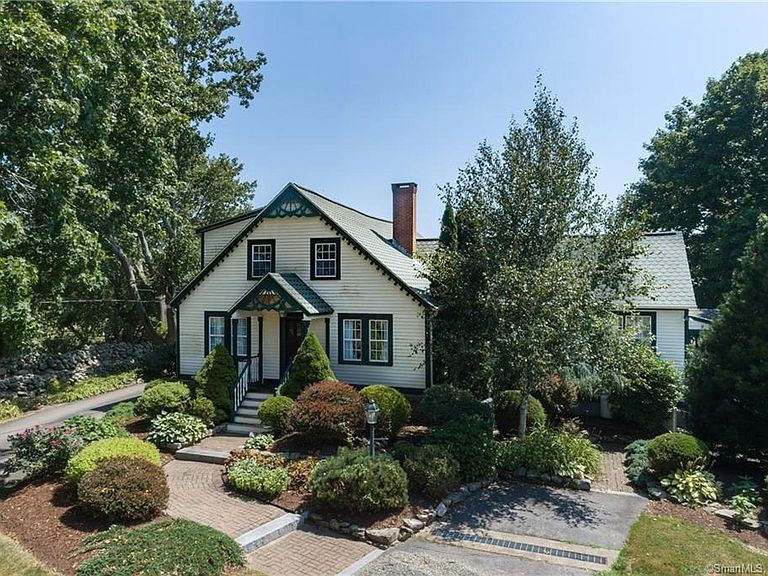



## Rustic Retreat

Information for our Airbnb Listing in Stonington, CT found [at this link.](https://www.airbnb.com/h/rusticretreatct)

### Entrance to the Airbnb

The entrance to the Airbnb and parking are located in the image below. 

### Parking

When you enter the driveway, please pull straight in and park in front of the Guest Parking sign that is visible straight ahead. Please limit the number of vehicles to no more than 2 cars. We unfortunately do not have the space to host many cars for this specific listing. 

No cars are allowed to be left parked in the driveway, or on the street in front of the house, after checkout time. 

### Thermostat Information

We have three thermostats in this apartment. The apartment is equipped with electric heat. The thermostats are located in each bedroom, and one just outside the bathroom door. 

### Air Conditioning

We have two air conditioners in the apartment. They are located in the bedroom and in the kitchen. These units are not controlled by the thermostats on the walls. You need to utilize the remote control to control both of these. The remote does have additional controls that you'll find by sliding down the cover of the remote. 

### Trash and Recycling

🟢  Green Bin is for Recycling

⚫  Metal Bin out front is for trash

No trash should be brought to the premises when you arrive. Please also place all trash and recycling in the appropriate bin before you leave. **Trash must be bagged**

### Pool Rules

Pool rules can be [found at this link.](/rusticretreat/poolrules)

### FAQ

1. There is someone outside by the pool. Do I need to be alarmed?
    * As described in the listing when you booked, the pool area is a shared space. As a result, you will likely encounter people out there. There should not be any parties, loud music, drinking, smoking, or other dangerous activities taking place by the pool. All guests should be following the posted pool rules. If at any time you are concerned for your safety, or the safety of others, please contact your host immediately. 
    
2. Will I have the entire house to myself?
    * As described in the listing, this is a separate upstairs apartment overlooking multiple beautiful farms in Stonington, CT.  The apartment is zoned separately from the main floor of the house where I live. There is a separate entrance and set of stairs up to the private apartment. There are no shared living spaces. You will have your own kitchen, living room, bathroom, bedrooms, and deck (including a propane fire table). That being said, you do have access to the entire outside property (3.5 acres) with this reservation and at times these spaces are shared with myself or other friends/guests. 

3. Can I use the pool?
    * Absolutely you are allowed to use the pool. Our list of pool rules can be [found here.](/rusticretreat/poolrules) 

4. Can I have a late checkout or early check-in?
    * No. The reason is that we are booked very regularly. As a result, it becomes very hard on your host and their cleaners to constantly need to handle late checkouts and early check-ins. Our check-in and check-out times give our cleaner ample time to ensure the space is in pristine condition between guests. If you have an extreme need for an early check-in or late check-out you may ask, but please be aware that it is hard to accomodate these all the time - especially during summer months and we reserve the right to say no. We mean no disrespect to you, or your plans. 

5. When was the house built?
    * The house was originally constructed in 1934. 

6. Is there any other cool history about the property?
    * We are directly adjacent to the estate of [Sergio Franchi](https://en.wikipedia.org/wiki/Sergio_Franchi). This is the reason for the name Sergio Franchi Drive. 

7. Can I walk down the road next door?
    * You are more than welcome to take a stroll down Sergio Franchi Drive. You will notice that the road comes to a natural point where the stonewalls end. This is where the public road ends, and the private estate begins. Please do not go onto the private estate. 

8. If I checkout early, can my trip price be reduced?
    * No. Unfortunately at this time we cannot offer discounts for guests that checkout early. If you need to cancel your stay, please see the section related to our cancellation policy. 























